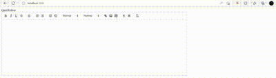

<h3 align="center">React Quill Component</h3>

<p align="center"> This is a Quill Editor Example (React)
    <br> 
</p>

## Demo



## 🐩 Dependencies <a name = "dep"></a>
Please go through `package.json` for more detail about dependencies.
- react-quilljs
- Quill 

## 🀄 Getting Started <a name = "getting_started"></a>

Install the dependencies from `package.json`. 

```bash
yarn install
or
npm install
```

### 🍠 Test the application

```bash
npm  start
```